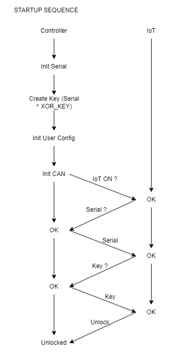

# FTEX CANOpen Protocol

This folder contains the public and internal FTEX protocols. Most importantly are the CANOpen protocol which drive all of the configurability of the FTEX controller platform.

#### Notable files:
- *FTEX_Controller_CANOpen_Protocol.json: this is our "public" protocol, shareable with third parties*
- *FTEX_Controller_JSON_Schema.json: this is the JSON schema validation file*
- *FTEX_Schema_validator.py: this script validates a JSON file against a schema*

## Protocol specification:
FTEX follows standard CANOpen protocol: https://www.can-cia.org/canopen/

FTEX uses SDO expedited transfer for transferring objects with up to four bytes.


Here, the <CMD> byte is dependent on the length of the data that are to be written. <CMD> can be one of the following values:
- 1 byte data length: 2Fh
- 2 byte data length: 2Bh
- 3 byte data length: 27h
- 4 byte data length: 23h

The <Data> field is written with the data that are to be written; the LSB of the data is entered in byte 4.

### Node ID
- 0x01: Node ID of the FTEX master controller
- 0x02: Node ID if the FTEX IoT module extension
- 0x03: Node ID of the FTEX slave controller (optional)
(This is only used in the case of dual motor, with one controller as master and one controller as slave. Therefore, this is only applicable in case of dual communication. You should only communicate with the master controller)"
- 0x04: Default node ID of the HMI (if present)
- 0x05: Default node ID of the battery/BMS (if present)
- 0x10: Default node ID of the PAS sensor (if present)

For now, the node IDs are not configurable. Contact FTEX otherwise.

### Baud rate
Default baud rate = 500Kbs

Baud rate can be configured with the CO_PARAM_BAUD_RATE parameter.

### Parameters persistence
Parameters are marked with a persistence of either *real-time*, *persistent*, or *both*.
- Real-time: the parameter will be immediately applied to the controller, but it won't persist after a restart
- Persistent: the parameter will be applied after the save command is ran (see "communication specification"), and be persistent even after a reboot. To save the parameter to the memory, the persistent save procedure below must be followed.
- Both: the parameter is immmediately applied to the controller, and it may also be saved to the controller's memory. To save the parameter to the memory, the persistent save procedure below must be followed.

A parameters change is not persistent (ie. saved after reboots) unless you use the following procedure: 
1 - Write in the parameter CO_PARAM_SAVE_PARAMETERS the value 0xD5A3 to let the controller know that save-persistent parameters will be changed.
2 - Change all of the desired parameters, respecting the range value of each one.
3 - Write in the parameter CO_PARAM_SAVE_PARAMETERS the value 0xC2E5.

Executing step 3 will make the controller save the parameters, reset and apply the new values.

### CAN Obfuscation Mechanism
The FTEX CAN communication protocols has a obfuscation parameter that allows the controller to mask all on its internal values, readable over CANOpen. The obfuscation parameter also prevents the user from writing a new value to the FTEX controller. In order to gain acccess to the obfuscated CAN parameters, the controller needs a valid FTEX IoT connected to it. The IoT connection, with the controller, will automatically deactivate any obfuscation of targeted CAN parameters.

#### Marking A Parameter As Obfuscated
Parameter obfuscation are always done within the protocol definitions (`*.json` included in this repos). There are currently 2 different ways to obfuscated a parameter : 
- Create the parameter in the `FTEX_Controller_Internal_CANOpen/FTEX_Controller_Internal_CANOpen.json` protocol file. Any parameter added in this file will automatically be treated as obfuscated.
- Set the `Obfuscation` flag to `True` when defining a Open parameter in the `FTEX_Controller_Public_CANOpen/FTEX_Controller_CANOpen_Protocol.json`. Setting the `Obfuscation` flag to `False` will bypass the obfuscation mechanism for this parameter.

Example 1 : In this snippet, the `Obfuscation` is set to `True`, the obfuscation mechanism will be activated for this parameter 
``` json
"CO_ID_UART_PROTOCOL": {
  "CANOpen_Index": "0x2038",
  "Description": "UART protocol parameter allows the user to select a specific UART protcol, mostly used to connect a UART screen to the FTEX bike system.",
  "Parameters": {
    "CO_PARAM_UART_PROTOCOL": {
      "Subindex": "0x00",
      "Access": "R/W",
      "Type": "uint8_t",
      "Description": "UART protocol selection. Default is 0x00 : UART Disable.",
      "Valid_Options": [
        { "value": 0, "description": "UART Disable : The FTEX controller does not used any UART protocol."},
        { "value": 1, "description": "UART APT Screen : The FTEX controller uses the APT screen protocol."},
        { "value": 2, "description": "UART Cloud Drive Screen : The FTEX controller uses the Cloud Drive screen protocol."},
        { "value": 3, "description": "UART KD718 Screen : The FTEX controller uses the KD718 screen protocol."},
        { "value": 4, "description": "UART EOL Tester Protocol : The FTEX controller uses the EOL tester protocol."},
        { "value": 100, "description": "UART High Speed Logger : The FTEX controller uses the high speed logger. This protocol is specified as an internal FTEX protocol."}
      ],
      "Persistence": "Persistent",
      "Obfuscation": "True"
    }
  }
}
```

Example 2 : In this snippet, the `Obfuscation` is set to `False`, the obfuscation mechanism will be deactivated for this parameter
``` json
"Communication and memory configuration": {
  "CO_ID_CAN_CONFIG": {
    "CANOpen_Index": "0x2060",
    "Description": "CAN configuration of the FTEX controller.",
    "Parameters": {
      "CO_PARAM_CAN_BAUD_RATE": {
        "Subindex": "0x00",
        "Access": "R/W",
        "Type": "uint8_t",
        "Description": "CAN baud rate of the system. The default is 500kbps. The FTEX IoT is always on 500kbps.",
        "Valid_Options": [
          { "value": 0, "description": "250 kbps" },
          { "value": 1, "description": "500 kbps" }
        ],
        "Persistence": "Persistent",
        "Obfuscation": "False"
      }
    }
  }
}
```

#### Obfuscation Bypass
There is currently only a single way for a user to bypass the obfuscation: Connecting an FTEX IoT module to the FTEX Controller. During the power on sequence between the FTEX Controller & IoT, some information will be exchange between the two and will allow an obfuscation mechanism bypass, allowing the user to access all CAN parameters. Sometimes, connecting an IoT is not always possible during the internal development process. This is the reason why we decided to add a compile time flag (`CAN_OBFUSCATION_BYPASS`) to manually bypass the obfuscation mechanism. For your everyday development work, I recommend simply defining this flag as `true` within your bike specific `vc_parameters.h` file, in the parent `GNR_Vehicles` repos. 

Example : Manual obfuscation mechanism bypass
``` c
/**
  * @file    vc_parameters_vehicle.h
  * @brief   This file contains the parameters to configure any arbitrary bike, used if we have a motor without a bike model.
  *
  */

/* Define to prevent recursive inclusion ---
----------------------------------*/
#ifndef __VC_PARAMETERS_VEHICLE_H
#define __VC_PARAMETERS_VEHICLE_H

#define VEHICLE_MODEL 0

#define SWD_CONTROL_ENABLE            0                   /* Enable controlling motor directly from debugging interface with vehicle control layer */
#if !SWD_CONTROL_ENABLE
    #define AUTOTUNE_ENABLE           1                   /* Disable vehicle cotrol and activates functions needed for auto tuning */
#endif

/* Change parameter below to quickly configure firmware */

#define GNR2_MASTER_NODE_ID           0x01                /* Node-ID of ganrunner master */
#define IOT_NODE_ID                   0x02                /* Node-ID of the IOT module(configured in the IOT firmware)*/
#define GNR2_SLAVE_NODE_ID            0x03                /* Node-ID of ganrunner slave */

// ...

#define CAN_OBFUSCATION_BYPASS true

// ...

/******************************** BATTERY SELECTION ******************************/

#include "batteries/velec_350w_battery.h"

#endif
```

Another way to bypass the obfuscation mechanism is to directly send the unlock command to the controller. The obfuscation will be deactivate for the duration of the controller's runtime. Let's say you are working on a controller with no access to an IoT module or the possibility to recompile the firmware, simply sending `0x29A4A5D0` to the CANOpen index:`0x6001`, subindex:`0x00`. 

#### Internal Obfuscation Mechanism
The previous sections served as an overview on how to use this feature on a day-to-day basis. The following section explains the implementation details of this feature.

Power on sequence between controller & IoT : The obfuscation mechanism activation is decided by a specific exchange between the controller and the IoT module. This exchange was implementated as an extension of our current power on sequence between both modules. The first step is masking the serial key with the last 4 digits of the serial number. Once the IoT validates that the serial key was masked with the right key, it write an unlock command key to an internal CAN parameter within the controller's internal protocol, requesting the controller to disable the obfuscation. As long as the unlock command key is set to this specific parameter, the controller will disable the obfuscation parameter. 

The following parameter is used to deactivate the obfuscation mechanism : 
``` json
"CAN Obfuscation": {
  "CO_ID_CAN_OBFUSCATION": {
    "CANOpen_Index": "0x6001",
    "Description": "CAN obfuscation parameters. Contains the XOR ciphered based keys used for runtime CAN obfuscation.",
    "Parameters": {
      "CO_PARAM_CAN_OBFUSCATION_UNLOCK_COMMAND": {
        "Subindex": "0x00",
        "Access": "R/W",
        "Type": "uint32_t",
        "Description": "Unlock CAN key, sent from the IoT.",
        "Valid_Range": {
          "min": 0,
          "max": 4294967295
        },
        "Persistence": "Real-time"
      }
    }
  }
}
```

Representation of the new power on sequence : 


Controller obfuscation : The controller is using two different XOR cipher based algorithm for its obfuscation mechanisms. The first one is used to send the serial, XOR masked with a secret key to the IoT during the power on sequence between both modules. We also include two bit rotation operation in order to add another layer of obfuscation, hiding the direct mapping from the key to the last 4 digits of the controller serial number. The combination of both creates the serial key that is sent to the IoT during the power on sequence.
``` c
#define CAN_OBFUSCATION_SERIAL_LEFT_ROTATE 7
#define CAN_OBFUSCATION_SERIAL_RIGHT_ROTATE 13
#define CAN_OBFUSCATION_SERIAL_XOR_MASK 0xC724E9AF

/**
  * @brief  Generate serial key from last 4 digits
  *         of controller serial number
  */
uint32_t CANObfuscation_GenerateSerialKey(uint32_t serial)
{
    // Serial key = ((serial RL 7) XOR CAN_OBFUSCATION_SERIAL_XOR_MASK) RR 13
    uint32_t key = __builtin_rotateleft32(serial, CAN_OBFUSCATION_SERIAL_LEFT_ROTATE);
    key = key ^ CAN_OBFUSCATION_SERIAL_XOR_MASK;
    obfuscation.serialKey = __builtin_rotateright32(key, CAN_OBFUSCATION_SERIAL_RIGHT_ROTATE);
    return obfuscation.serialKey;
}
```

During the controller's runtime, we use a different algorithm to obfuscate the CAN parameters. In order to add a pseudo-randomness to the CAN parameters obfuscation, we use the raw ADC value of the controller's heat sink sensor. This allows the mechanism to mask each obfuscated CAN parameter value with a different XOR mask during different runtimes. This is the mechanism used to create the parameter XOR mask : 
``` c
// We initialize the runtime obfuscation param key
// In order to inject some pseudo-random factor into the mix, we used the controller heat sink ADC value
// This gives us a different parameter key every runtime.
#define CAN_OBFUSCATION_PARAM_XOR_MASK 0x37D0385B

if(obfuscation.paramKey == 0)
{
    obfuscation.paramKey = HALConfigDriver_ReadADCChannelValue("heat_sink\0") ^ CAN_OBFUSCATION_PARAM_XOR_MASK;
    obfuscation.paramKey = __builtin_rotateright32(obfuscation.paramKey, (uint8_t)(obfuscation.paramKey));
}
```

IoT obfuscation : On the IoT's side, the only validation made is the serial number match and the `CAN_OBFUSCATION_SERIAL_XOR_MASK`. If the IoT validates that the last 4 digits of the serial matches the controller's serial and that it is using the `CAN_OBFUSCATION_SERIAL_XOR_MASK`, it will send the obfuscation unlock command key. 

### CAN peripherals requirements
The FTEX controller can interact with other peripherals on the CAN bus, such as the IoT, the HMI and the BMS. 
However, the following must be supported by the peripherals on the CAN bus to use all of the FTEX controller features.

#### HMI and BMS
- Node ID: see the node ID section above. 
- Heartbeat: An HMI communicating over CAN bus with the controller must send CAN heartbeats (https://www.can-cia.org/can-knowledge/canopen/error-control-protocols - Heartbeat section)
The controller expects healthy heartbeats from the HMI at least every 50ms.
If no HMI heartbeats are detected within a 500ms window, the controller determines that screen communication is lost, and disables HMI-driven features like throttle and cruise over CAN. Also, an error is raised over CAN if there are missing heartbeats from the HMI or from the BMS.

*Todos:*
- Add protocol communication specification [DONE]
- Add BMS protocol in JSON format [DONE]
- Add autotune JSON protocol [DONE]
- Add internal FTEX protocol for motor configuration [DONE]
- Add internal FTEX protocol specification for DFU [DONE]
- Add (or redo) internal FTEX protocol specification for custom IoT stuff
- Add schema validation in the CI/CD pipeline [DONE]
- Controller firmware should consume the newly minted JSON files [DONE]
- Config and diags tools should consume the newly minted JSON files too
- Add Error codes definition [DONE]
- schema validation of unique CO_ID name, unique param names, unique index, and unique subindex within an index [DONE]
